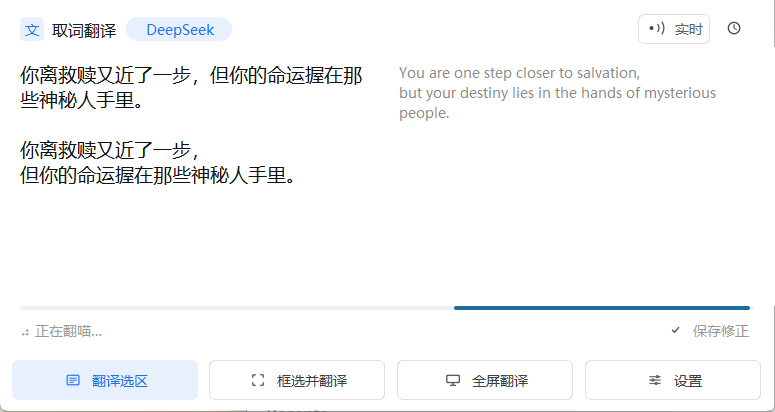
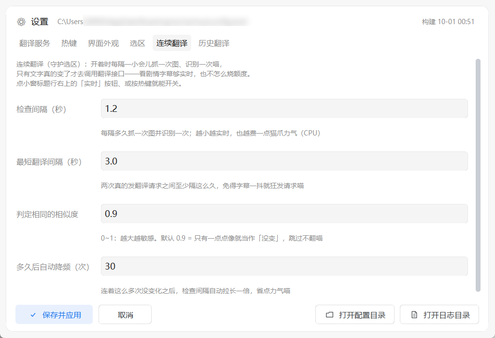
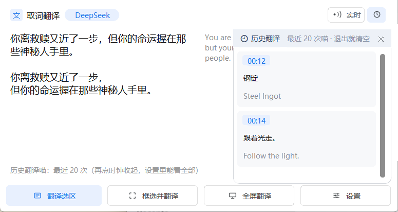
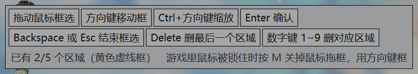

# mchanhua · Minecraft 屏幕取词翻译

[](LICENSE)
[](#环境要求)
[](pyproject.toml)
[](#开发)

> 按热键框住游戏里的英文，本地 OCR 识别 + AI 翻译，在一个小窗里显示译文（原文同时对照）。
> 只读取屏幕，**不改动游戏文件、不注入进程**，纯粹给自己玩的时候看懂。
>
> 仓库里还有一套 **Minecraft 游戏内模组**（1.20.1 / 1.21.1 / 1.21.8 / 26.1.2 四个版本），见 [Minecraft 模组版](#minecraft-模组版4-个游戏版本)。


<sub>译文在上、原文在右侧对照；横向拉长时自动左右并排，竖向时上下排列</sub>



<sub>翻译进行中：状态栏转圈 + 底部细进度条，按钮带图标与悬停/按下反馈</sub>

## 功能

**取词方式**（热键都可以在设置里改）

| 默认热键 | 作用 |
|---|---|
| `Ctrl+Alt` | 翻译所有已保存的区域（整屏只抓一次、OCR 一次） |
| `Alt+/` | 框选一块并立刻翻译（不保存） |
| `Alt+m` | 全屏翻译（整屏识别，取前 60 行） |
| `Alt+s` | 翻译剪贴板里的图片（配合 `Win+Shift+S` 截图） |
| `Alt+v` | 框选并保存区域：`Enter` 存一个、`Delete` 撤上一个、数字键 `1~9` 删指定区域、`Esc` 结束 |
| `Alt+c` | 连续翻译（守护选区）开关：文字一变就自动翻，再按一次停止 |
| `Ctrl+Alt+W` | 显示 / 隐藏小窗 |
| 区域专属热键 | 在 设置 →「选区」里给某个区域单独绑一条（默认没有），按一下只翻这一块 |

热键支持键盘录制（点输入框直接按组合键）和「选择按键」（按住一个或多个键，**只按 `Ctrl+Alt` 这类纯修饰键组合也能录**）。录制期间会自动暂停全局热键，不会误触发翻译。

**多语言**：源语言默认「自动识别」（本地按字符集判断 + 让模型自己判断），目标语言可选中/繁中文、英、日、韩、俄。识别语言在 设置 →「翻译服务」→「识别语言（OCR）」里选：中英和**日语**都用程序自带的模型（日语识别模型约 9MB，随包分发，能认假名）；韩语 / 俄语需要系统先装对应语言的 OCR 语言包（Windows 设置 → 时间和语言 → 语言和区域 → 添加语言 → 在它的语言选项里勾上「光学字符识别」）。缺东西时程序会在状态栏直接告诉你怎么装，不会闷着不动。

**多区域**：游戏里要看的字往往不止一处（物品提示、任务追踪、字幕……）。用 `Alt+v` 连续框最多 5 块，`Ctrl+Alt` 一次翻完 —— 整屏只抓一次图、OCR 只跑一次，按区域筛行后合并成一次翻译请求，**多翻几块既不变慢也不多花钱**。译文与原文按 `［区域1］`、`［区域2］` 分组显示。

**区域类型与专属热键**：每个区域可以选一个类型 —— 「物品」（提示模型用 Minecraft 社区通用译名、译得短，不参与「整理成段」）或「字幕」（口语化、把被切碎的行接回通顺整句）。物品提示和剧情字幕混在同一次取词里时，会分成两批请求，各带各的提示词。给某个区域绑一条**专属热键**（设置 →「选区」，每个区域下面一行）后，按一下只翻这一块。那一页左下角还有「框选新区域」按钮，不用记热键也能直接去框。

**连续翻译 · 实时（守护选区）**：按 `Alt+c`（或点小窗标题行的「实时」按钮）开始盯住选区。之后程序每隔一小会儿抓一次图、跑一次 OCR（都在本机，不花钱），**只有文字真的变了才去调用翻译接口**——看剧情字幕不用一遍遍按热键，也不会因为字幕抖一下就狂发请求。窗口不遮挡选区时它就一直守着，连续多次没变化会自动降频；再按一次 `Alt+c` 停止。检查间隔、最短翻译间隔、相似度阈值都能在设置 →「连续翻译」里调。


**翻译质量**

- 提示词针对 Minecraft 调过：口语化、保留情绪，不机翻腔；
- **OCR 预处理 + 行合并**：画面发灰时自动增强对比度（也可选锐化 / 灰度 / 二值化）；被 OCR 切碎的同句续行、以及同一行被切成的左右碎片，都会在送翻译前拼回整句；
- **专有名词一致性**：模型在返回里顺手给出本批的人名/地名表，应用攒成「自动术语表」在下一批带上——同一个名字从头到尾只用一种译法；术语文档只留 24 小时，过期自动清掉（设置 →「翻译服务」可看条数、一键清空）；
- **术语表按需注入**：只把本批文本里真的出现过的术语塞进提示词（带 OCR 容错：`P0ISON`、`MychaeI` 这类认错写法也能命中），术语表再长也不撑提示词；
- 额外给一段「整段整理」译文：把被 OCR 切碎的行接回去、按中文语序组织（严格限制不得增删信息，逐行译文仍保留可核对）；
- 支持术语表固定专有名词译法；
- **中英混排照翻**：OCR 常把系统提示和英文台词接到一行（`You are one step closer ... in已将截图保存为1.png`），这种半中半英的行以前会整行跳过，现在按文字种类判断——中文部分原样保留、英文部分照翻；
- OCR 容错：提示模型按最接近的常见英文词理解识别错误（`l/I`、`o/0`、`rn/m` 之类）；
- sqlite 翻译缓存，同一句只翻一次；网络抖动自动重试（0.6s、1.2s 退避），服务端错误不重试。

**改译文**：小窗里的译文框可以直接编辑，改完点状态栏右边的「保存修正」（按钮常驻，改过之后会变蓝）：这一行立刻写进 sqlite 缓存（**以后同一句不再问模型**）；如果改的是短名词（物品名、按钮名那种），还会一并记进术语表，影响之后所有请求。历史记录里的那条也会跟着更新（仍只存在内存里）。

**翻译服务**：DeepSeek / OpenAI / Kimi / 通义千问 / 智谱 / 硅基流动 / Ollama（本地，免 key）/ 自定义 OpenAI 兼容接口，随时切换。

**界面**

- 小窗是白卡片 + 透明外框，可拖动、可调透明度；
- **按钮带线性图标与悬停/按下反馈**，翻译时状态栏转圈 + 底部细进度条，历史浮层从右侧滑入（图标由 `tools/make_icons.py` 生成，不用 emoji——不同 Windows 上 emoji 会变彩色或方框）；
- **横向拉长时译文与原文自动左右并排**，竖向时上下排列；底部按钮永远贴住窗口底边；
- 时钟按钮展开「最近 20 次」翻译历史（窗内浮层，退出程序即清空）；
- 设置窗口包含翻译服务、热键、界面外观（配色/字号/透明度）、选区管理、连续翻译、历史翻译六个页签。

**设置与浮层**

|  |  |
|---|---|
|  翻译服务 / 识别语言 / 自动术语表 |  选区：类型 + 专属热键 |
|  连续翻译的间隔与阈值 |  时钟按钮展开的最近 20 次 |



<sub>框选遮罩不抢游戏焦点，按键提示做成带边框的小标签</sub>

## 环境要求

- Windows 10 / 11（x64）
- 屏幕缩放 100%~200% 均可（内部统一按物理像素处理，不会错位）
- 一个翻译服务的 API Key；用 Ollama 则完全免费离线
- 体积：压缩包约 113 MB，解压后约 256 MB（自带 OCR 模型与日语识别模型，不需要额外下载）

## 安装

### A. 安装包（推荐）

1. 到 **Releases** 下载 `mchanhua-4.0.0-win64.zip`（约 113 MB），解压到任意目录（例如 `D:\mchanhua`）；
2. 双击文件夹里的 `mchanhua.exe` 就能用（绿色版，无需安装、无需 Python）；
3. 小窗右下角「设置」→「翻译服务」填 API Key →「测试连接」→「保存并应用」；
4. 同目录下的 `HOW-TO-USE.txt` 是给第一次使用者看的上手说明（热键、配置位置、常见问题）。

> 想让程序出现在开始菜单/桌面（而不是每次去文件夹里点），可以拿源码跑一次 `.\安装.cmd`：
> 它会把 `dist\mchanhua` 复制到 `%LOCALAPPDATA%\Programs\mchanhua` 并建快捷方式。

### B. 源码运行

```powershell
git clone <你的仓库地址> mchanhua
cd mchanhua
python -m venv .venv
.\.venv\Scripts\python.exe -m pip install -r requirements.txt
.\.venv\Scripts\python.exe -m mchanhua run
```

### C. 自己打包

```powershell
.\打包.cmd
```

会先跑测试，再用 PyInstaller 生成 `dist\mchanhua\mchanhua.exe`；`.\安装.cmd` 负责安装到本机。
发布用的压缩包是 `.\打包发布包.cmd`（生成 `dist\mchanhua-4.0.0-win64.zip`，内含 exe 与 `HOW-TO-USE.txt`）。

## 使用

1. 在游戏里按 `Alt+v`，把要翻译的地方框起来（可以连框几块），`Esc` 结束；
2. 之后按 `Ctrl+Alt` 就能一次翻完所有区域；
3. 只想临时翻一块，按 `Alt+/` 框完立刻出结果；
4. 小窗左上角显示整理后的整段译文，下面是逐行译文，右侧（宽窗口时）是原文对照。

### 游戏里鼠标被锁住怎么办

第一人称游戏（《我的世界》等）在前台全屏时会**独占鼠标**，而且**一失去前台就会弹出游戏菜单**挡住画面。所以框选遮罩采用「不抢焦点」的方式：游戏不会失焦，字幕一直看得见；框选时用**方向键移动框、`Ctrl+方向键` 缩放、`Enter` 确认**即可（这些键在 MC 里默认没有绑定，不会误操作）。也可以按 `M` 临时开/关鼠标拖框。

## 配置与日志

- 配置：`%APPDATA%\mchanhua\config.toml`（API Key、热键、区域、外观都在里面；项目目录下的 `config.local.toml` 优先级更高，不会被提交）
- 日志：`%APPDATA%\mchanhua\logs\mchanhua.log`（启动时会写「启动自检」，记录实际加载的配置与热键，排查问题先看它）
- 调试：`%APPDATA%\mchanhua\debug\`（最近一次抓图与识别结果）

几个常用开关：

| 配置项 | 默认 | 说明 |
|---|---|---|
| `translate.humanize` | `true` | 是否让模型额外给「整段整理」译文 |
| `translate.cache_enabled` | `true` | 翻译缓存 |
| `ocr.settle_frames` | `2` | 抓屏前确认画面稳定的帧数，设 `1` 最快但可能抓到半截提示框 |
| `regions.clear_on_exit` | `true` | 退出程序时清空已保存的区域 |

## 常见问题

**框选时鼠标不动？** 游戏锁着鼠标，用方向键框（见上文），或把游戏设成窗口化/无边框窗口。

**框出来的区域没文字？** 小窗会提示「选区内没有识别到文字」，不会把整屏内容当成选区结果翻译。

**翻译看起来不全？** 默认 `ocr.capture_mode = "screen"`（整屏识别再按选区筛行），能保证每一行完整；如果嫌慢可改成 `padded`。

**区域每次重启就没了？** 这是 `regions.clear_on_exit = true` 的默认行为，改成 `false` 就会保留。

**快捷键和别的软件冲突？** 设置 →「热键」页改掉即可，冲突时保存会提示。

**费用？** 只有翻译请求会调用你的 API；OCR 完全在你本机跑。多区域共用一次请求，缓存命中的句子不重复计费。

## 开发

```powershell
.\.venv\Scripts\python.exe -m pytest        # 489 项测试
```

目录结构：

```
mchanhua/            程序本体
  capture.py         屏幕采集（mss，Pillow 兜底）+ 画面稳定检测
  ocr/               OCR 后端（Windows OCR / RapidOCR）
  translate/         翻译层（OpenAI 兼容 + 缓存 + 术语表 + 占位符保护）
  ui/                小窗、设置窗口、框选遮罩、主题
  app.py             采集 → OCR → 翻译 → 界面的接线
tests/               489 项测试（纯逻辑 + 界面冒烟 + 真实 OCR 模型）
docs/                开发过程中的设计/调研/打包说明
tools/make_icon.py   生成程序图标
tools/make_icons.py  生成界面按钮用的线性图标
```

更多细节见 [docs/](docs/)：[v4 总览](docs/v4-总览.md)（当前版本的设计与取舍）、打包说明、OCR 精度记录、同类项目调研（UGTLive / SubLens 等）与借鉴点；改动历史见 [CHANGELOG](CHANGELOG.md)。

欢迎 issue 和 PR。改代码前建议先跑一遍测试；本项目约定**每次改动都补测试并保持全绿**。

## Minecraft 模组版（4 个游戏版本）

和桌面版是两条路、同一个目标：**把游戏里的英文/日文变成中文给你看懂**。

| | 桌面版（本仓库主程序） | 模组版（`mod/` 等四个目录） |
|---|---|---|
| 怎么拿到文字 | 屏幕截图 + OCR | 直接挂在游戏的**文本 API** 上拿原始字符串 |
| 适用范围 | 任何游戏、任何版本 | 只支持对应的 Minecraft + Fabric 版本 |
| 准确度 | 受字体/背景影响 | 拿到的是原始文本，**没有 OCR 误差** |
| 要不要装模组 | 不用 | 要装 Fabric 模组 |

### 支持哪些版本

| 目录 | 游戏版本 | 映射与工具链 | Java | 状态 |
|---|---|---|---|---|
| `mod/` | **26.1.2** | Mojang 官方映射 + Loom 1.18 | 25 | 已实测 |
| `mod-1.21.8/` | **1.21.8** | Yarn + Loom 1.13.6 | 21 | 已实测 |
| `mod-legacy/` | **1.21.1** | Yarn + Loom 1.13.6 | 21 | 已实测 |
| `mod-1.20.1/` | **1.20.1** | Yarn + Loom 1.13.6 | 17 | 已实测 |

> 这四个是**独立工程**，不是一份代码编四个版本：不同世代的 Minecraft 内部 API 差异很大
> （1.20.5 改了 tooltip 参数、1.21.2 把实体渲染改成"状态驱动"、26.x 又是新一代），
> 每个版本都要单独适配并在游戏里验证。

### 功能

- **物品 tooltip**：悬停物品就地翻成中文（混排文本只翻英文行，游戏自带的中文属性行原样保留）
- **聊天栏**：翻本地显示的那份，不改服务器数据、不替玩家发言
- **标题 / 副标题 / ActionBar**：地图常用它们放台词，翻好再显示，不会先闪一句英文
- **Boss 栏**、**告示牌**、**实体头顶名牌**（玩家 ID 不翻）、**世界里的悬浮大字**、**成书书页**（按行翻，行数与分段不变）
- **HUD 小窗**：右上角显示最近一次翻译（译文 + 原文对照），可开关、可自动收起
- **游戏内设置界面（热键 `K`）**：填 API Key、选服务商/模型、开关各项功能、一键测试连通性

### 安装

1. 装对应版本的 **Fabric Loader** 与 **Fabric API**
2. 把对应的 jar 丢进该版本的 `mods/` 目录
3. 进游戏按 `K` 打开设置，把 API Key 粘进去（默认打码显示），点「测试一下」确认通了

> jar 与游戏版本**必须对应**：把 1.21.1 的 jar 装到 1.21.8 上会在启动时"模组注入失败"。

### 热键

| 热键 | 作用 |
|---|---|
| `H` | 开关右上角翻译小窗 |
| `J` | 测试一次翻译（确认 API Key 通不通） |
| `K` | 打开设置界面 |

### 设计要点

- **不改存档**：告示牌/名牌/悬浮字/书页都只在"画出来的那一份"上替换文本，方块实体与实体数据一个字节都不动
- **按行翻译**：带换行的文本会拆开逐行翻再拼回，行数与分段不变（地图那种"一整屏规则"不会丢行）
- **不卡帧**：渲染线程只查内存缓存，查不到就先显示原文、后台异步翻，译文回来下一帧替换
- **省请求**：同一段文本只翻一次（LRU 缓存落盘），失败不写缓存、可重试

### 自己构建

```bash
cd mod            # 或 mod-1.21.8 / mod-legacy / mod-1.20.1
./gradlew build   # 构建 + 跑纯逻辑自测（不需要开游戏）
```

各目录的自测加起来 200+ 项（折行/配置兜底/按行翻译/缓存行为），**不进游戏、不联网**就能跑。

### 已知限制

- **画在贴图里的字翻不了**：模组挂的是文本 API，图片里的文字它看不见——这种用桌面版 OCR 处理
- **模组自己的 GUI**（如 FTB Quests 的任务书）没有通用挂点，需要按具体模组适配

## 许可

[MIT](LICENSE)

第三方组件：Pillow、mss、httpx、keyboard、customtkinter、RapidOCR（PP-OCR 模型）、Windows OCR（系统自带）—— 均遵循各自许可证。
